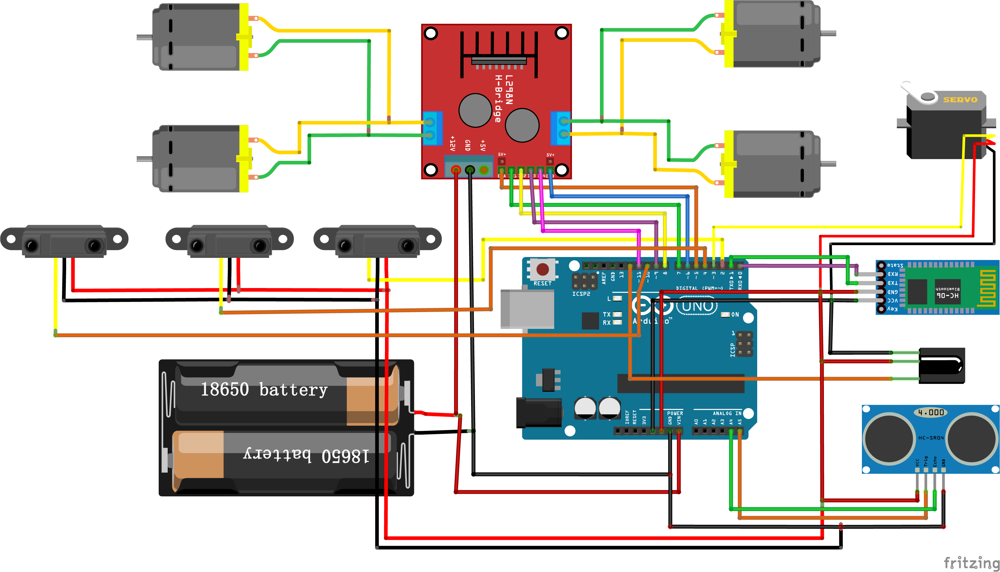

# Arduino code for a Elegoo Smart Car v3.0


### by Antonio Perez & @javacasm

 
 



[Código](./code/)

## Depuración usando pantall de 4 dígitos de 7 segmentos

Seguimos el esquema de conexión del kit de elegoo (Part 3 - Lesson 5)


[Código](.code/4xSevenSegments/4xSevenSegments.ino)

```c++
//www.elegoo.com
//2016.12.12

int latch = 9;   //74HC595  pin 9  latch (STCP)
int clock = 10;   //74HC595  pin 10 clock (SHCP)
int data  = 8;   //74HC595  pin 8  data (DS)


void setup() {
  pinMode(latch, OUTPUT);
  pinMode(clock, OUTPUT);
  pinMode(data, OUTPUT);
  Serial.begin(9600);
}

void Display(unsigned char num){

  digitalWrite(latch,LOW);
  shiftOut(data,clock,MSBFIRST,table[num]);
  digitalWrite(latch,HIGH);
  
}

void loop() {
  for(int i = 0; i <= 16; i++){
    Display(i);  
    delay(500);
    Serial.println(i);
  }
}

```